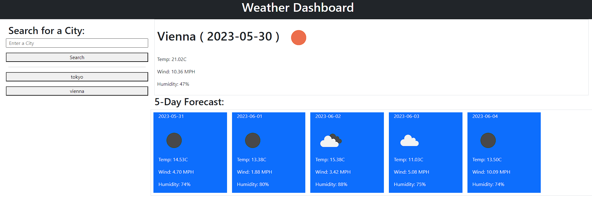

# Weather-Dashboard
AS A traveler I WANT to see the weather outlook for multiple cities SO THAT I can plan a trip accordingly.

## Description
The goal of this website is to show the user the current weather and the weather for the next 5 days for the city they want to know. This identifies the demand from the user of wanting to see the weather outlook for multiple cities so that they can make plans accordingly. This webpage solves the problem of not knowing the coming day's weather forecast of any given city. In building this project, I learned how to properly use serverside APIs and extract the data I need from the API.

Link to deployed app: https://cdelacruzzin.github.io/Weather-Dashboard/

Preview:
;

## Usage
When you initially open the webpage, you will only see the title, a searchbox, and a search button. Input any existing city in the searchbox and click the search button. You will then be presented with the current weather, and the weather forecast for the next 5 days. In each weather report, you will see the date, a weather icon, the temperature, wind speed, and humidity. Each city you search will be saved in the history under the search button. Click on the cities in the history to seach for its weather forecast. Your history will be saved for the next time you load the page.

## Credits
1, dayjs
2. jQuery
3. openweather api

## License
Refer to LICENSE file in README.